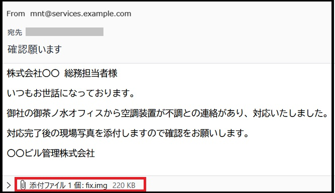

# サイバー攻撃の疑似体験サイト

ここは、最近数多く観測されている、マルウェアを感染させることを目的としたサイバー攻撃の手口を疑似体験できるサイトです。

体験デモですので危険性はなく、「感染しました（デモ）」というようなメッセージが表示されるだけです。

もちろん実際に悪性ファイルや悪性コマンドが実行されることはありません。

【お願い】

このサイトのURLは公には公開せず、集合研修等に参加された方にのみお伝えしているものです。

SNS等での拡散や、悪性サイトとして通報するようなことはお控えください。

### ①フィッシングメールに添付された不正ファイルを実行させる手口

添付ファイルをこちらからダウンロードし、ダブルクリックで開いて下さい。

⇒ [添付ファイル / fix.img](https://sooshima.github.io/fish-demo/1_PhishingMail/%E6%B7%BB%E4%BB%98%E3%83%95%E3%82%A1%E3%82%A4%E3%83%AB/fix.img)

### ②ClickFixと呼ばれる不正コマンドをユーザーに実行させる手口

あなたは、動画サイトが本来許可していない方法で掲載動画をダウンロードしようと考え、検索で見つけたこちらの動画変換サイトにアクセスしようとしています。

⇒ [（偽）動画変換サイト](https://sooshima.github.io/fish-demo/2_Clickfix/usotube_convert.html)